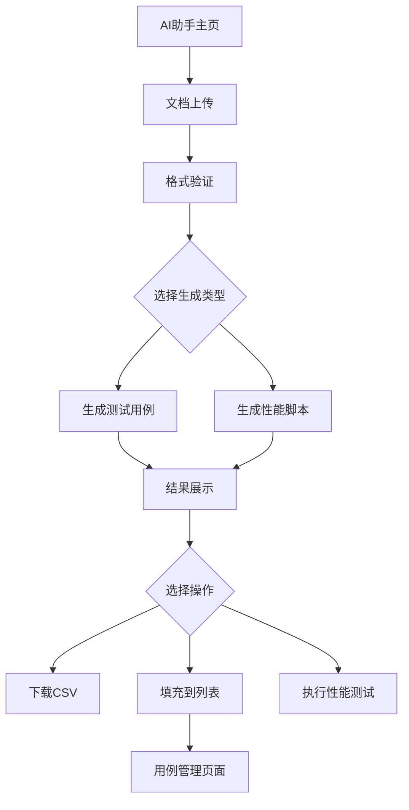

## 1. 产品概述

AI助手页面是一个智能化的API文档处理工具，帮助开发者和测试人员快速生成接口测试用例和性能测试脚本。通过上传API文档，自动生成标准化的测试资产，提升测试效率和质量。

目标用户为软件开发团队、测试工程师和API开发者，解决手工编写测试用例和性能脚本的低效问题。

## 2. 核心功能

### 2.1 用户角色

| 角色   | 注册方式  | 核心权限             |
| ---- | ----- | ---------------- |
| 普通用户 | 邮箱注册  | 上传文档、生成测试用例、下载结果 |
| 高级用户 | 邀请码升级 | 执行性能测试、管理测试用例列表  |

### 2.2 功能模块

AI助手页面包含以下核心功能：

1. **文档上传区**：支持拖拽上传，格式验证，文档预览
2. **测试用例生成**：智能解析API文档，生成CSV格式测试用例
3. **性能脚本生成**：自动生成k6性能测试脚本
4. **结果管理**：下载生成功能，测试用例列表管理

### 2.3 页面详情

| 页面名称    | 模块名称   | 功能描述                                             |
| ------- | ------ | ------------------------------------------------ |
| AI助手主页面 | 文档上传区域 | 支持拖拽上传Markdown/Swagger/OpenAPI文档，实时显示上传进度和格式验证结果 |
| AI助手主页面 | 生成选项卡  | 提供"生成测试用例"和"生成性能脚本"两个选项，支持批量处理和自定义配置             |
| AI助手主页面 | 结果展示区域 | 显示生成的CSV测试用例预览，提供下载按钮和填充到用例列表的功能                 |
| AI助手主页面 | 性能测试控制 | 显示生成的k6脚本内容，提供下载脚本和直接执行测试的按钮                     |
| 用例管理页面  | 测试用例列表 | 展示所有生成的测试用例，支持编辑、删除、导出操作                         |
| 用例管理页面  | 批量操作   | 支持批量导出、批量删除和用例分类管理                               |

## 3. 核心流程

### 主要用户操作流程：

1. 用户进入AI助手页面，选择或拖拽上传API文档
2. 系统验证文档格式并解析API结构
3. 用户选择生成类型（测试用例/性能脚本）
4. 系统处理并显示生成结果
5. 用户选择下载结果或填充到用例管理列表

## 4. 用户界面设计

### 4.1 设计风格

* **主色调**：科技蓝(#1890ff)搭配深空灰(#141414)

* **按钮样式**：圆角矩形，主要操作为实心按钮，次要操作为边框按钮

* **字体规范**：主标题18px加粗，正文14px常规，辅助文字12px

* **布局风格**：卡片式布局，左侧功能区域，右侧结果展示

* **图标风格**：使用Ant Design图标库，线性风格，统一尺寸

### 4.2 页面设计概览

| 页面名称    | 模块名称  | UI元素                                  |
| ------- | ----- | ------------------------------------- |
| AI助手主页面 | 文档上传区 | 拖拽区域虚线边框，上传图标居中，支持多文件同时上传，显示文件列表和上传进度 |
| AI助手主页面 | 生成控制区 | 选项卡切换按钮，生成进度条，参数配置面板（折叠式）             |
| AI助手主页面 | 结果展示区 | CSV表格预览（带滚动条），代码高亮显示k6脚本，操作按钮固定在底部    |
| 用例管理页面  | 列表展示区 | 表格形式展示测试用例，支持排序和筛选，每行提供编辑和删除图标        |
| 用例管理页面  | 工具栏   | 顶部批量操作按钮组，搜索框和筛选下拉菜单                  |

### 4.3 响应式设计

* **桌面优先**：主界面宽度1200px，支持1920x1080分辨率

* **平板适配**：768px-1199px宽度，侧边栏收起，表格横向滚动

* **移动端优化**：小于768px时，采用垂直堆叠布局，操作按钮放大便于

