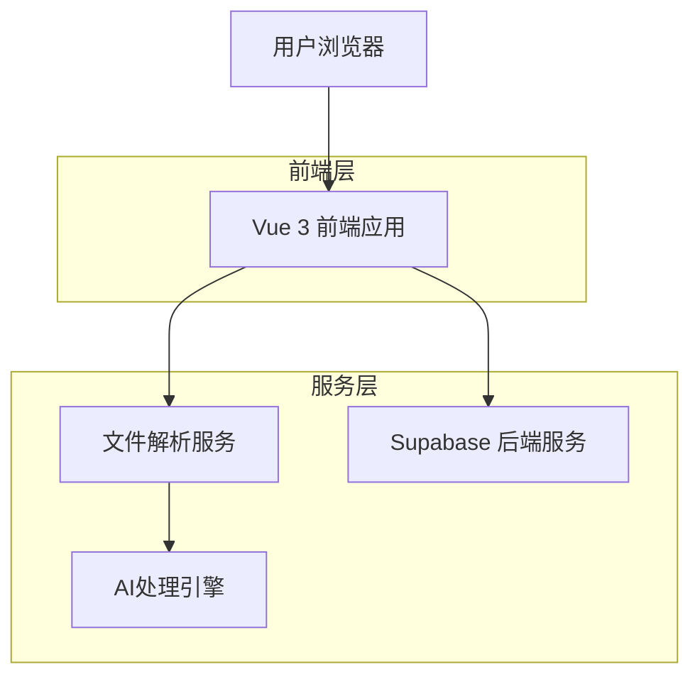
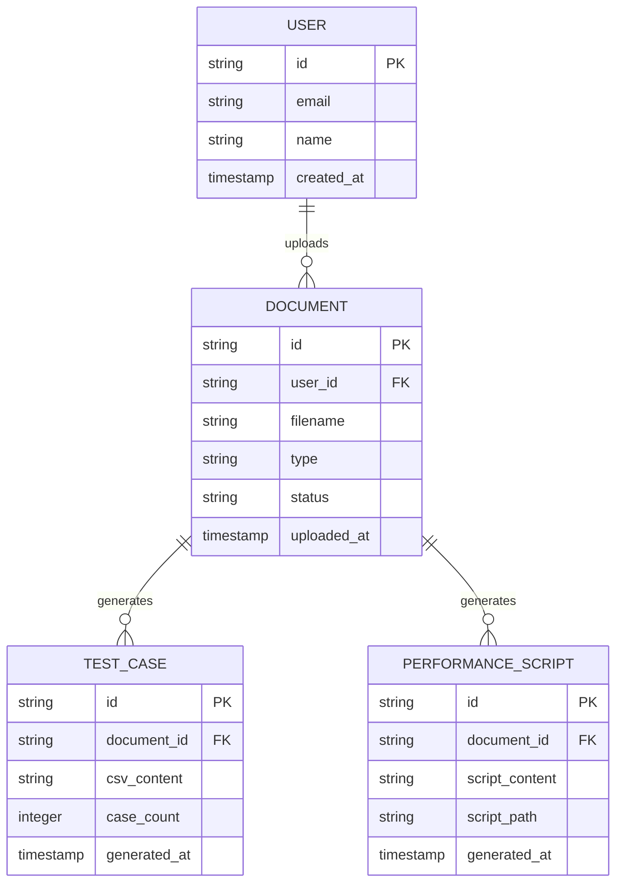

## 1. 架构设计



## 2. 技术描述

- **前端**: Vue 3 + TypeScript + Vite + Element Plus
- **初始化工具**: vite-init
- **后端**: Supabase (PostgreSQL + Storage + Auth)
- **AI处理**: OpenAI API (文档解析和生成逻辑)
- **文件处理**: 客户端解析，支持大文件分片上传

## 3. 路由定义

| 路由 | 用途 |
|------|------|
| / | AI助手主页面，文档上传和生成功能 |
| /case-management | 测试用例管理页面，查看和编辑生成的用例 |
| /history | 历史记录页面，查看之前的生成记录 |

## 4. API 定义

### 4.1 文档上传相关
```
POST /api/document/upload
```

请求:
| 参数名 | 参数类型 | 是否必需 | 描述 |
|--------|----------|----------|------|
| file | File | 是 | API文档文件 |
| type | string | 是 | 文档类型: markdown/swagger/openapi |

响应:
| 参数名 | 参数类型 | 描述 |
|--------|----------|------|
| success | boolean | 上传状态 |
| documentId | string | 文档唯一标识 |
| parsedData | object | 解析后的API结构 |

示例:
```json
{
  "success": true,
  "documentId": "doc_123456",
  "parsedData": {
    "apis": [
      {
        "method": "GET",
        "path": "/api/users",
        "parameters": []
      }
    ]
  }
}
```

### 4.2 测试用例生成
```
POST /api/test-cases/generate
```

请求:
| 参数名 | 参数类型 | 是否必需 | 描述 |
|--------|----------|----------|------|
| documentId | string | 是 | 文档ID |
| options | object | 否 | 生成选项配置 |

响应:
| 参数名 | 参数类型 | 描述 |
|--------|----------|------|
| success | boolean | 生成状态 |
| csvContent | string | CSV格式的测试用例 |
| caseCount | number | 生成的用例数量 |

### 4.3 性能脚本生成
```
POST /api/performance-script/generate
```

请求:
| 参数名 | 参数类型 | 是否必需 | 描述 |
|--------|----------|----------|------|
| documentId | string | 是 | 文档ID |
| config | object | 否 | k6脚本配置 |

响应:
| 参数名 | 参数类型 | 描述 |
|--------|----------|------|
| success | boolean | 生成状态 |
| scriptContent | string | k6脚本内容 |
| scriptPath | string | 脚本文件路径 |

## 5. 数据模型

### 5.1 数据模型定义


### 5.2 数据定义语言

用户表 (users)
```sql
-- 创建用户表
CREATE TABLE users (
    id UUID PRIMARY KEY DEFAULT gen_random_uuid(),
    email VARCHAR(255) UNIQUE NOT NULL,
    name VARCHAR(100) NOT NULL,
    created_at TIMESTAMP WITH TIME ZONE DEFAULT NOW()
);

-- 创建文档表
document表 (documents)
CREATE TABLE documents (
    id UUID PRIMARY KEY DEFAULT gen_random_uuid(),
    user_id UUID REFERENCES users(id) ON DELETE CASCADE,
    filename VARCHAR(255) NOT NULL,
    type VARCHAR(50) NOT NULL CHECK (type IN ('markdown', 'swagger', 'openapi')),
    status VARCHAR(50) DEFAULT 'pending',
    file_path TEXT,
    uploaded_at TIMESTAMP WITH TIME ZONE DEFAULT NOW()
);

-- 创建测试用例表
test_cases表 (test_cases)
CREATE TABLE test_cases (
    id UUID PRIMARY KEY DEFAULT gen_random_uuid(),
    document_id UUID REFERENCES documents(id) ON DELETE CASCADE,
    csv_content TEXT NOT NULL,
    case_count INTEGER NOT NULL,
    generated_at TIMESTAMP WITH TIME ZONE DEFAULT NOW()
);

-- 创建性能脚本表
performance_scripts表 (performance_scripts)
CREATE TABLE performance_scripts (
    id UUID PRIMARY KEY DEFAULT gen_random_uuid(),
    document_id UUID REFERENCES documents(id) ON DELETE CASCADE,
    script_content TEXT NOT NULL,
    script_path TEXT,
    generated_at TIMESTAMP WITH TIME ZONE DEFAULT NOW()
);

-- 创建索引
CREATE INDEX idx_documents_user_id ON documents(user_id);
CREATE INDEX idx_documents_uploaded_at ON documents(uploaded_at DESC);
CREATE INDEX idx_test_cases_document_id ON test_cases(document_id);
CREATE INDEX idx_performance_scripts_document_id ON performance_scripts(document_id);

-- 设置权限
GRANT SELECT ON documents TO anon;
GRANT ALL PRIVILEGES ON documents TO authenticated;
GRANT SELECT ON test_cases TO anon;
GRANT ALL PRIVILEGES ON test_cases TO authenticated;
GRANT SELECT ON performance_scripts TO anon;
GRANT ALL PRIVILEGES ON performance_scripts TO authenticated;
```

## 6. 前端组件架构

### 6.1 主要组件结构
```
src/
├── components/
│   ├── DocumentUpload.vue      # 文档上传组件
│   ├── GenerationOptions.vue   # 生成选项组件
│   ├── ResultDisplay.vue       # 结果展示组件
│   ├── CaseManagement.vue      # 用例管理组件
│   └── PerformanceRunner.vue   # 性能测试执行组件
├── services/
│   ├── documentService.ts      # 文档处理服务
│   ├── testCaseService.ts      # 测试用例服务
│   └── performanceService.ts   # 性能测试服务
├── types/
│   ├── document.ts              # 文档相关类型
│   ├── testCase.ts             # 测试用例类型
│   └── performance.ts          # 性能测试类型
└── utils/
    ├── fileParser.ts           # 文件解析工具
    └── csvGenerator.ts         # CSV生成工具
```

### 6.2 状态管理
使用 Pinia 进行状态管理，主要 Store：
- `documentStore`: 管理上传的文档状态
- `testCaseStore`: 管理生成的测试用例
- `performanceStore`: 管理性能测试脚本